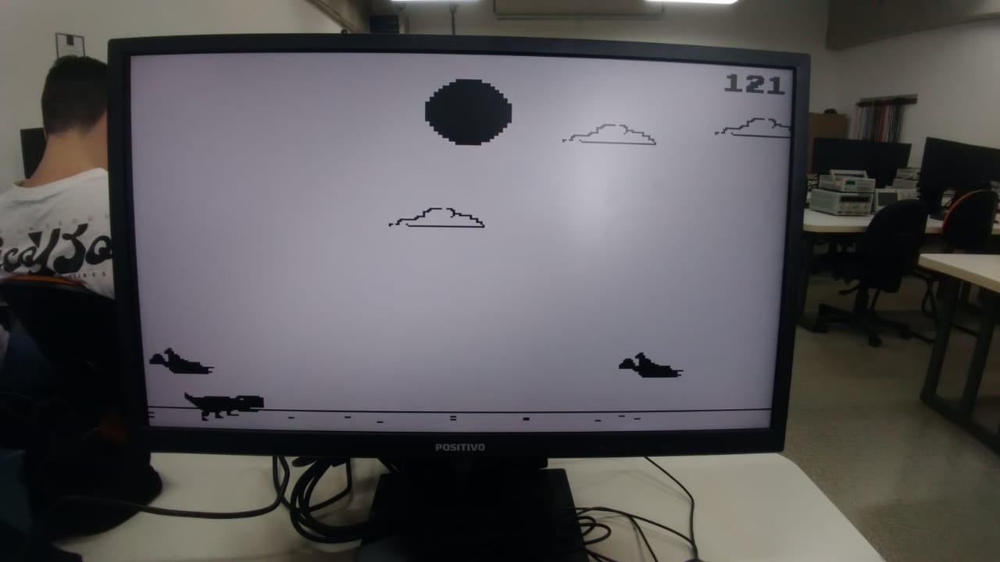
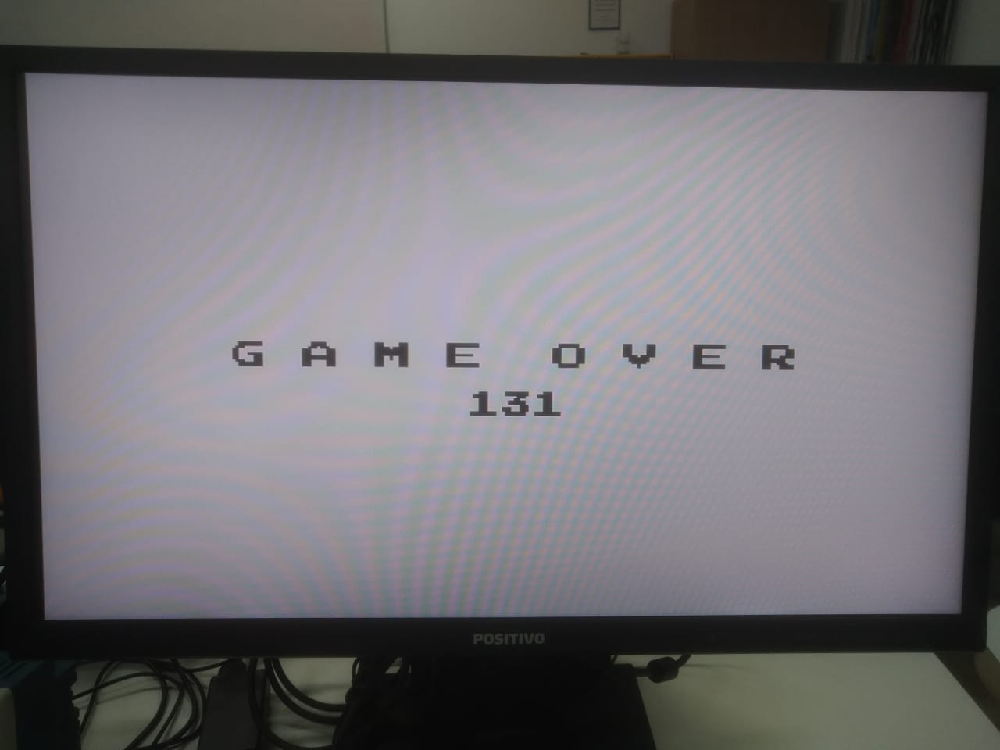

# Dino_FPGA_Embarcados

Jogo estilo **Chrome Dino**, desenvolvido como projeto final da disciplina de **Projeto de Sistemas Computacionais Embarcados** (UFSCar). Implementado em **linguagem C** e executado diretamente no processador **ARM Cortex-A9** da FPGA **DE10-Standard**.

## :video_game: Características Principais

- Execução 100% embarcada (sem computador externo).
- Gráficos em tempo real via **saída VGA** (320x240 pixels).
- Controle do dinossauro pelas **chaves físicas (KEYs)** da FPGA.
- Elementos gráficos desenhados como **bitmaps** diretamente no framebuffer.
- Troca automática de tema (dia/noite).
- Obstáculos variados (cactos e pássaros).
- Animações do dinossauro (corrida, pulo e abaixado).
- Placar e sistema de pontuação.
- Tela de Game Over.

## :floppy_disk: Arquivos do Projeto

- `dino_fpga.c` — Código-fonte principal do jogo.
- `address_map_arm.h` — Definições de mapeamento de memória.
- `Dinoussauro_p2.amp` — Arquivo de projeto do Intel Monitor Program.

> As imagens bitmap e os vídeos demonstrativos devem ser organizados na pasta `/media` ou conforme preferência.

## :gear: Requisitos

- Placa **DE10-Standard** (Terasic).
- Software **Intel FPGA Monitor Program** (Quartus Prime opcional).
- Monitor externo via **saída VGA**.
- Uso das **chaves KEY0** (pulo) e **KEY1** (abaixar).

## :tv: Mídias

- 📷 Imagens do jogo em execução:

<p align="center">
  
  
  
  
  
  
</p>

- 🎥 [Vídeo de demonstração no Google Drive](https://drive.google.com/file/d/1Jg21BqgiIf8z2gxjvxtYR6zhrmLHtB3L/view?usp=drive_link)

## :rocket: Execução

1. Compile e carregue o projeto via **Intel FPGA Monitor Program**.
2. Conecte um monitor VGA na saída da placa.
3. Use **KEY0** para pular e **KEY1** para abaixar o personagem.
4. Evite os obstáculos e maximize sua pontuação.

## :computer: Exemplo de Código

### Bitmaps no Código

Todos os **bitmaps necessários para o funcionamento do jogo** (nuvens, cactos, pássaros, sol, lua, sprites do dinossauro, números para pontuação, tela inicial e tela de Game Over) estão definidos diretamente no arquivo `dino_fpga.c` como **matrizes estáticas** do tipo `const short`.

A seguir, um **exemplo** da definição do bitmap da nuvem:

```c
const short nuvem[12][45] = {
    {0,0,0,0,0,0,0,0,0,0,0,0,0,0,0,0,0,0,0,1,1,1,1,1,1,0,0,1,1,1,0,0,0,0,0,0,0,0,0,0,0,0,0,0,0},
    {0,0,0,0,0,0,0,0,0,0,0,0,0,0,0,0,0,0,1,1,0,0,0,0,0,0,0,0,0,1,1,0,0,0,0,0,0,0,0,0,0,0,0,0,0},
    {0,0,0,0,0,0,0,0,0,0,0,0,0,0,0,0,1,1,1,0,0,0,0,0,0,0,0,0,0,0,1,0,0,0,0,0,0,0,0,0,0,0,0,0,0},
    {0,0,0,0,0,0,0,0,0,0,0,0,0,0,0,0,1,0,0,0,0,0,0,0,0,0,0,0,0,0,1,1,1,1,0,0,0,0,0,0,0,0,0,0,0},
    {0,0,0,0,0,0,0,0,0,0,0,0,0,0,0,0,1,0,0,0,0,0,0,0,0,0,0,0,0,0,1,0,0,1,1,1,1,1,1,0,0,0,0,0,0},
    {0,0,0,0,0,0,0,0,0,0,0,0,0,1,1,1,1,0,0,0,0,0,0,0,0,0,0,0,0,1,0,0,0,0,0,0,0,0,1,0,0,0,0,0,0},
    {0,0,0,0,0,0,0,0,0,0,0,0,1,1,0,0,0,0,0,0,0,0,0,0,0,0,0,0,0,0,0,0,0,0,0,0,0,0,1,1,1,1,0,0,0},
    {0,0,0,0,0,1,1,1,1,1,1,1,1,0,0,0,0,0,0,0,0,0,0,0,0,0,0,0,0,0,0,0,0,0,0,0,0,0,0,0,0,1,0,0,0},
    {0,0,0,0,1,1,0,0,0,0,0,0,0,0,0,0,0,0,0,0,0,0,0,0,0,0,0,0,0,0,0,0,0,0,0,0,0,0,0,0,0,1,1,1,0},
    {0,0,0,0,1,0,0,0,0,0,0,0,0,0,0,0,0,0,0,0,0,0,0,0,0,0,0,0,0,0,0,0,0,0,0,0,0,0,0,0,0,0,0,1,0},
    {1,1,0,1,1,0,0,0,1,0,0,0,0,0,0,0,0,0,0,0,0,0,0,0,0,0,0,0,0,0,0,0,0,0,0,0,0,0,0,0,0,0,0,0,1},
    {1,0,0,0,0,0,0,0,0,1,1,1,1,1,1,1,1,1,1,1,1,1,1,1,1,1,1,1,1,1,1,1,1,1,1,1,1,1,1,1,1,1,1,1,1},
};
```

Cada valor `1` representa um pixel preenchido, enquanto `0` indica transparência.

Você pode replicar esse padrão para definir todos os demais sprites.

## :busts_in_silhouette: Créditos

- João Vitor Ribeiro de Oliveira (813109)
- Davi Cerchiari Alves (813985)

**Professor:** Emerson Carlos Pedrino  
**Universidade Federal de São Carlos (UFSCar)** — Departamento de Computação

## :page_facing_up: Licença

Projeto desenvolvido exclusivamente para fins acadêmicos.
